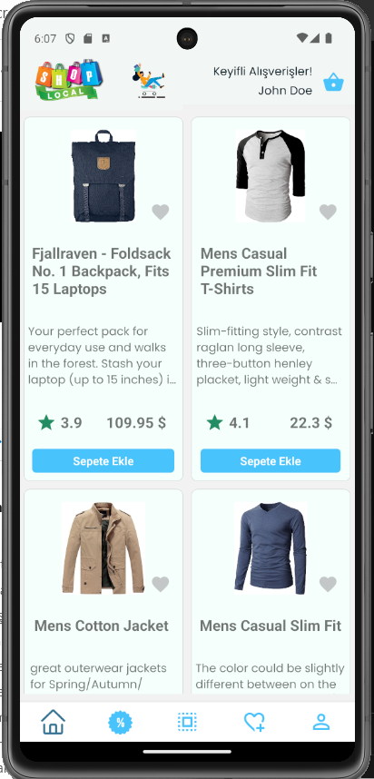
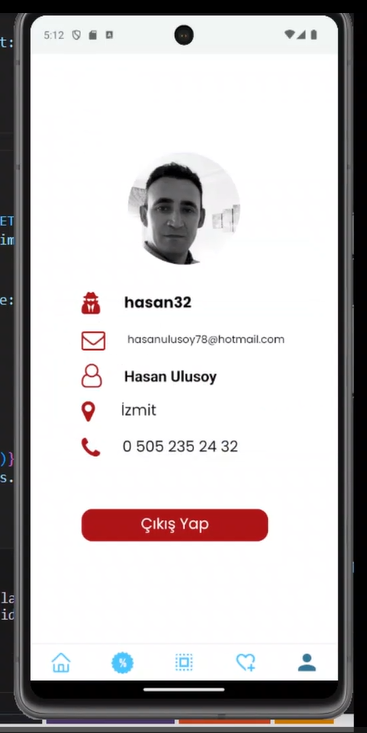

# myApp E-Shop Project

# React Native Project

- screen alanlarındaki style kısımları kaldırılmıştır. :)

- Bu projede login ile giriş, register, free gezinti, favori ve sepet işlemleri bunlarda login kontrolü, sepette eksiltme ve azaltma işlemleri, favori sayasında sepete yönlendirme, indirim sayfası buradan indirim alanlarına yönlendirme, ürünleri kategorilere göre gösterme, ürün üzerinde detay sayfaına yönlendirme, ürünler üzerinde favori ve sepet sayfasına eklem gibi birçok özellik eklenerek bir ticaret aplikasyonu dizyn edilmiştir.

- öneriler ve düşünceleriniz için 
- hasanulusoy78@hotmail.com

- API : https://fakestoreapi.com/

# Screens
- Product
- Detail
- Basket
- Favorite
- Login
- Register
- Free Search
- Category
- Sales

# kütüphaneler
- react-native-community/masked-view
- react-navigation/bottom-tabs
- react-navigation/native-stack
- formik
- yup
- redux-thunk
- redux
- react-redux
- react-native-vector-icons
- react-native-svg
- react-native-screens
- react-native-safe-area-context
- react-native
- lottie-react-native
- iconsax-react-native
- eva-icons
- ui-kitten/components
- eva-design/eva
- react-native-async-storage/async-storage

## Preview

# E-Commerce_React-Native
# E-Commerce_React-Native
# E-Commerce_React-Native
